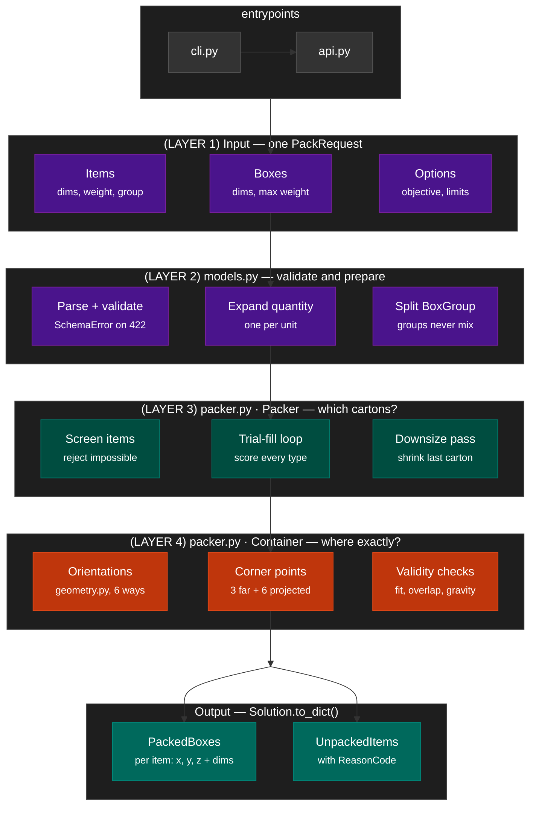

# BoxSolverAlgorithm

A deterministic 3D bin-packing engine in pure Python: given a catalogue of
cartons and a list of items, it decides **which cartons to use** and **exactly
where each item goes inside them**.

Written as a replacement for [BoxPacker](https://github.com/dvdoug/boxpacker),
with extensibility and constraint handling as the design goals. The core engine
has **zero third-party dependencies** — it runs on a bare interpreter, and the
HTTP transport is optional.

[](https://github.com/AdrasAyman/BoxSolverAlgorithm/actions/workflows/ci.yml)

---

## Architecture



---

## Quick start

```bash
python -m boxsolver.entrypoints.cli --boxes data/boxes.json --items data/items.json
```

```
Packed 3 item(s) into 2 box(es) in 1.3 ms (7.6% volume used)

  Box 0: MED (400.0x400.0x400.0 mm, group GROUP-A)
    weight 3.8 kg items + 0.75 kg box = 4.55 kg (limit 15.2 kg)
      [0] ITM-001#1    at (    0.0,     0.0,     0.0) size 100.0x200.0x50.0 orient WLD
      [1] ITM-002#1    at (  100.0,     0.0,     0.0) size 300.0x150.0x75.0 orient WLD
```

As a library:

```python
from boxsolver import pack_payload

result = pack_payload({
    "Boxes": [{"Reference": "SML", "Width": 150, "Length": 150, "Depth": 150,
               "MaxWeight": 8.5, "BoxWeight": 0.5}],
    "Items": [{"ItemCode": "ITM-001", "ItemReference": "Widget A",
               "Width": 100, "Length": 200, "Depth": 50, "Weight": 1.0}],
})
```

As a service:

```bash
pip install -r requirements.txt
uvicorn boxsolver.entrypoints.api:app --reload --port 8000
# -> http://localhost:8000/docs for interactive Swagger
```

Tests and benchmark:

```bash
pytest -q                    # unit, API and boundary tests
python tests/benchmark.py    # runtime + quality at scale
```

Full setup instructions are in [`GETTING_STARTED.md`](GETTING_STARTED.md).

---

## Repository layout

```
boxsolver/
  core/
    geometry.py   six axis-aligned orientations; Euler angles derived, not hard-coded
    container.py  precise item placement and physical validity checks
    packer.py     carton selection, trial-fill loop, and downsize pass
  models.py       BoxType / Item / PackingConfig + schema-faithful, tolerant parsing
  output.py       stable solution output contract
  entrypoints/
    api.py        FastAPI transport
    cli.py        terminal entry point
schemas/
  packer_schemas.yaml   base BoxType + Item definitions
  boxsolver_api.yaml    the public request/response contract
data/                   sample and benchmark datasets
docs/
  sample_response.json  a real response against the sample data
tests/
  test_boxsolver.py     geometry, parsing, and packing invariants
  test_api.py           HTTP surface
  test_boundary_precision.py  floating-point and boundary cases
  integration_test.py   contract and schema compliance
  benchmark.py          runtime + utilisation at 10 -> 400 items
```

---

## How it works

Two nested heuristics.

**1. Placement — where does one item go in one carton?**
A corner-point (extreme-point) heuristic. The carton starts with a single
candidate corner at the origin. Placing an item at `(x,y,z)` with extents
`(dx,dy,dz)` retires that corner and offers three new ones: `(x+dx,y,z)`,
`(x,y+dy,z)`, `(x,y,z+dz)`. Every candidate is tested in every distinct
orientation against three constraints — inside the walls, no overlap, adequately
supported from below — and scored `(z, y, x, height)` so the load builds in flat
layers from the floor up.

**2. Carton selection — which carton, and how many?**
Best-fit greedy. While items remain, *every* still-available box type is
trial-filled and scored, and the best one is committed. A final **downsize pass**
re-tests each committed carton against every smaller type, which is what stops a
greedy run from ending with one large, nearly-empty carton holding a single
widget.

Items are packed largest-volume-first. `BoxGroup`s are partitioned *before*
packing, so mixing groups isn't merely unlikely, it's structurally impossible.

The whole thing is **deterministic** — same input, same output, byte for byte.
That matters for log correlation, for reproducing a bug report, and for
regression testing.

### Constraints handled today

| Constraint | Source |
|---|---|
| Item fits within internal box dimensions | schema |
| No two items overlap | physics |
| 6-way axis-aligned rotation, per-item restrictable | requirement |
| `MaxWeight` — capacity for contents, **excluding** `BoxWeight` | requirement |
| `Active: false` boxes never used | schema |
| `MaximumBoxes` quota per box type | schema |
| `BoxGroup` — never mixed | schema |
| Gravity / stack support (configurable, default 50% of base) | requirement |
| Load sequence is physically valid (never bury an earlier item) | operations |

### Roadmap

Load-bearing limits (heavy-on-fragile), centre-of-gravity balancing, non-cuboid
items, multi-order consolidation, cylinder and irregular shapes. All are
additive — the constraint checks live in one method, `Container._is_valid`.

---

## Performance

Mixed sizes, mixed box groups, gravity on, single core:

| Items | Median solve | Cartons | Volume used |
|------:|-------------:|--------:|------------:|
| 10 | 0.001 s | 2.7 | 22% |
| 50 | 0.013 s | 2.3 | 62% |
| 100 | 0.059 s | 3.0 | 70% |
| 200 | 0.197 s | 5.7 | 73% |
| 400 | 0.675 s | 10.3 | 76% |

Roughly 400 items in under a second. Complexity is about `O(B . N^2 . R)`; a
soft `TimeLimitSeconds` (default 20s) guards pathological inputs by returning
the best complete solution so far rather than hanging.

Utilisation climbs with order size because small orders are dominated by carton
granularity — three items in a 400mm carton will never look efficient.

---

## Design decisions and their reasoning

**Python, not C++/Go/Rust.** For a production packer running millions of solves,
a compiled language is the right call. Here it isn't. Measured runtime is ~0.7s
for 400 items against a 60s budget, so performance is not the binding
constraint — integration and iteration speed are. If profiling ever shows a real
bottleneck, the hot loop is `Container.find_placement`, which is isolated behind
a clean interface and can be moved to C++ via pybind11 or to Rust via PyO3
without touching anything else.

**Support ratio defaults to 50%.** Stacking constraints cost cartons. Measured
at 200 items: 0% support -> 5.25 cartons at 79.5% full; 50% -> 5.75 at 74.2%;
100% -> 6.50 at 68.1%. 50% keeps loads physically sensible without paying the
full stability tax.

**Bottom-left-fill beat contact-area scoring.** A contact-area maximisation
heuristic was implemented and benchmarked as an alternative placement score. It
was ~2x slower and produced *worse* utilisation on the test orders, so it was
dropped. Recorded here so nobody re-litigates it.

**Zero dependencies in the core.** `boxsolver.entrypoints.api` needs FastAPI;
nothing else needs anything. A consumer can vendor the package without
inheriting the dependency tree.

**Stateless.** No database, no request IDs, no caching. Persistence is the
caller's concern; this keeps the surface area to one function.

---

## License

MIT — see [LICENSE](LICENSE).

## Acknowledgements

BoxSolverAlgorithm began as a university software-engineering capstone project
built to an industry client brief, and is published here with the team's
permission. Benchmark comparisons use [dvdoug/boxpacker](https://github.com/dvdoug/boxpacker)
as the reference implementation.
